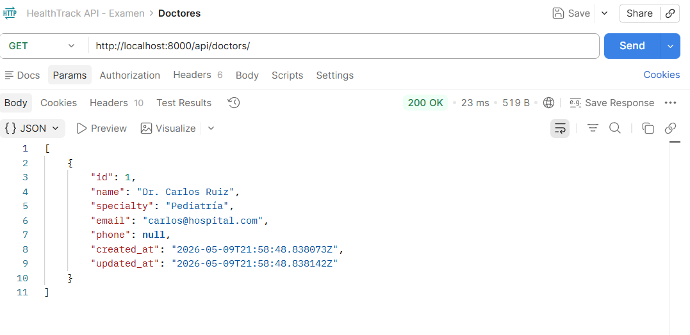
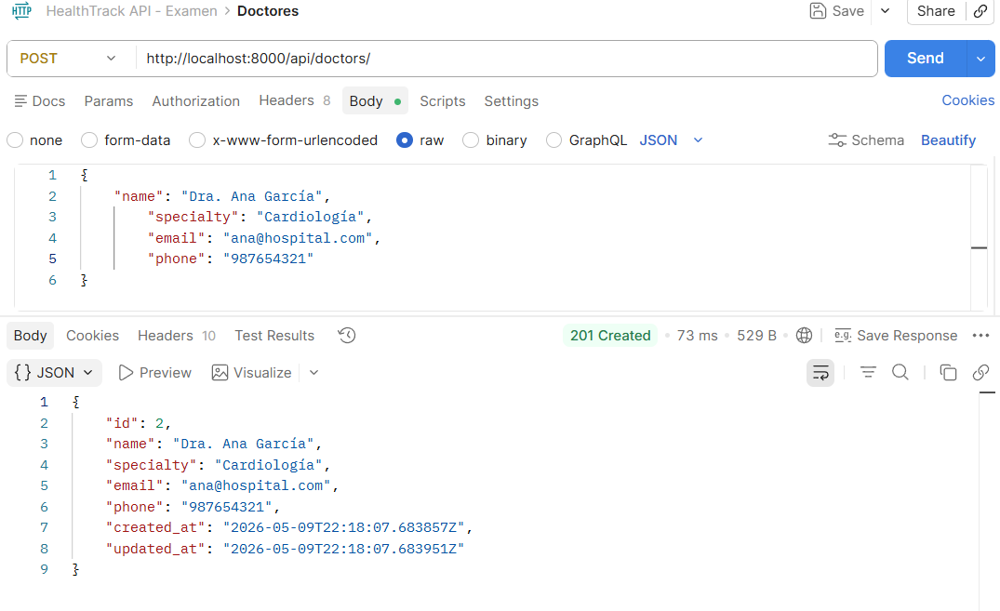
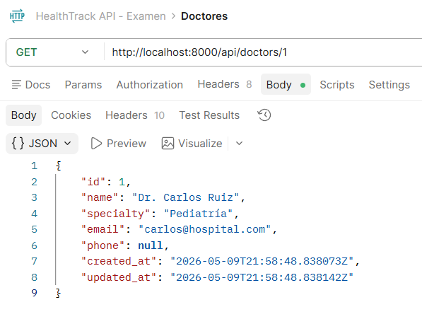
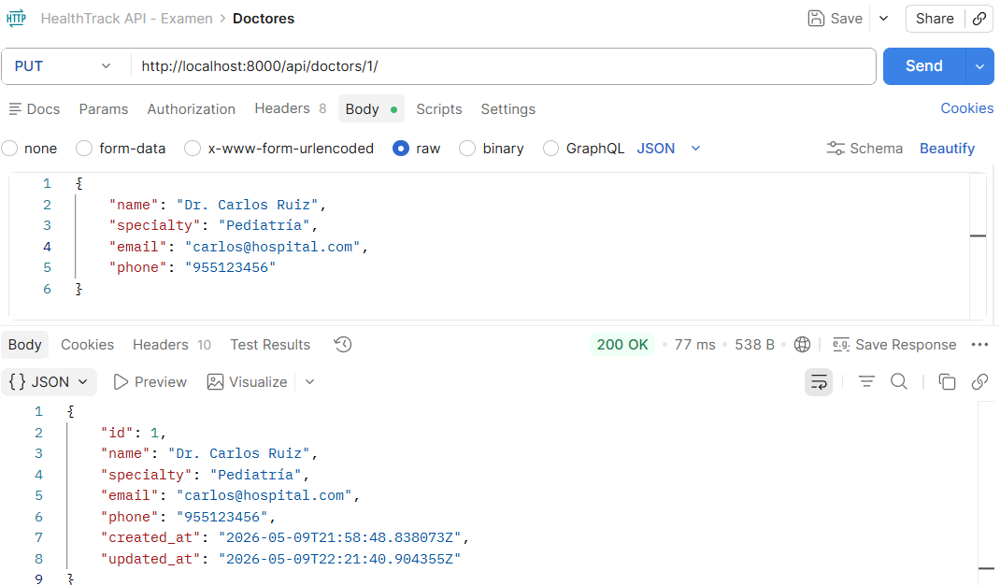
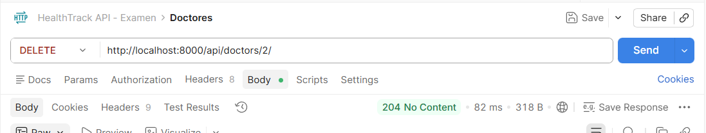
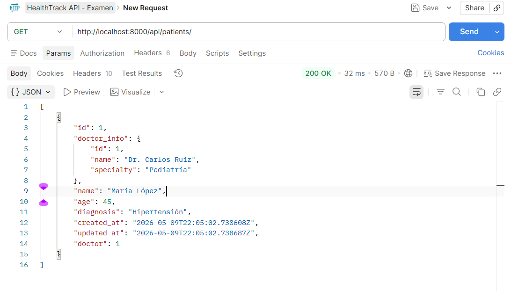
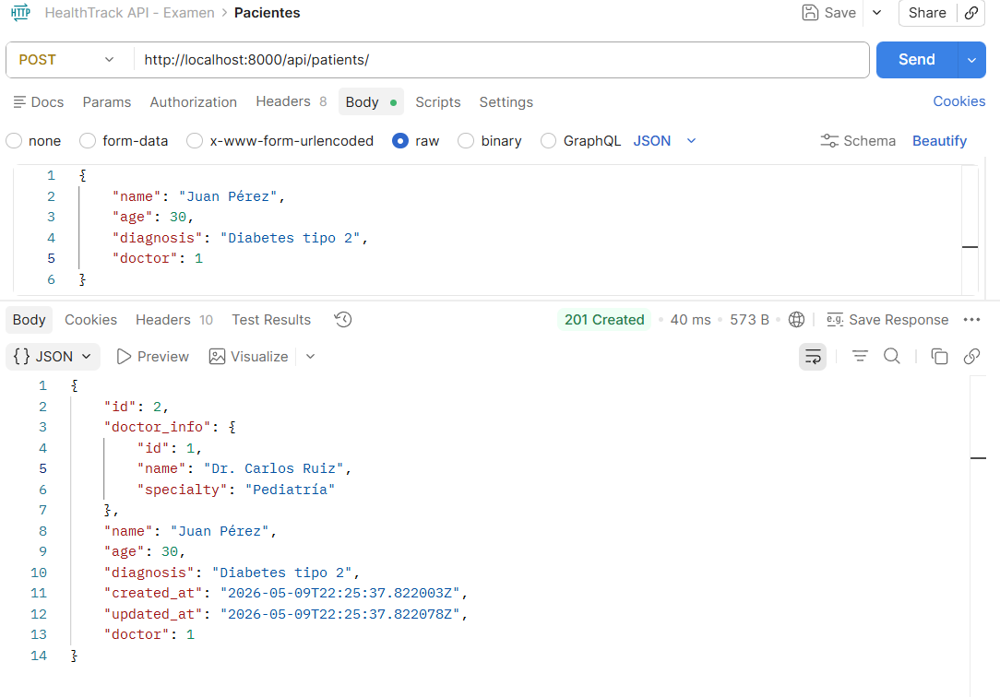
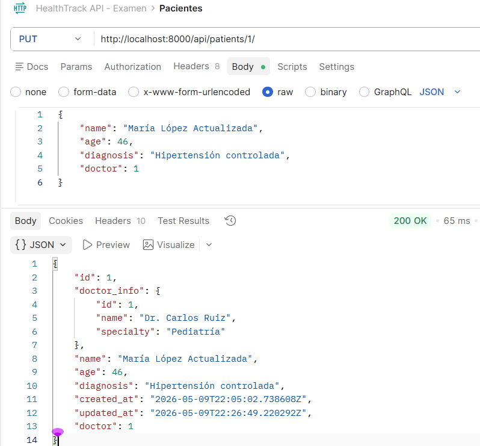
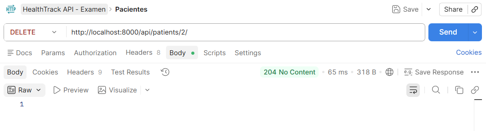
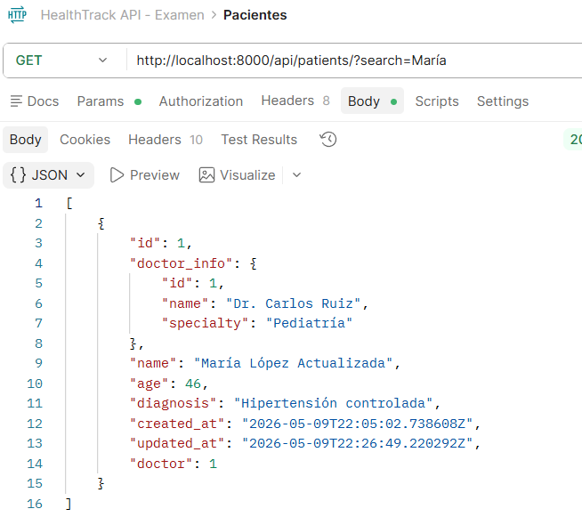

🏥 HealthTrack API - Gestor de Pacientes y Doctores
📖 Descripción

API REST para la gestión de pacientes y doctores, desarrollada con Django REST Framework.
Permite realizar operaciones CRUD completas para doctores y pacientes, incluyendo búsqueda de pacientes y visualización de información relacionada del doctor asignado.

🚀 Tecnologías utilizadas
Python 3.13+
Django 6.0.5
Django REST Framework
django-filter
SQLite3
⚙️ Instalación y ejecución
### Clonar repositorio
git clone https://github.com/adrianachinchayhuar-dev/healthtrack_api.git

### Ingresar al proyecto
cd healthtrack_api

### Crear entorno virtual
python -m venv venv

### Activar entorno virtual (Windows)
venv\Scripts\activate

### Instalar dependencias
pip install -r requirements.txt

### Ejecutar migraciones
python manage.py migrate

### Iniciar servidor
python manage.py runserver

Servidor local:

http://localhost:8000

📌 Endpoints
👨‍⚕️ Doctores
Método	Endpoint
- GET	/api/doctors/
- POST	/api/doctors/
- GET	/api/doctors/{id}/
- PUT	/api/doctors/{id}/
- DELETE	/api/doctors/{id}/
📸 Evidencias de Endpoints - Doctores
🔹 GET - Listar doctores

🔹 POST - Crear doctor

🔹 GET - Listar doctor por ID

🔹 PUT - Actualizar doctor

🔹 DELETE - Eliminar doctor

🧑‍🦱 Pacientes
Método	Endpoint
- GET	/api/patients/
- POST	/api/patients/
- GET	/api/patients/{id}/
- PUT	/api/patients/{id}/
- DELETE	/api/patients/{id}/
- GET	/api/patients/?search={termino}
📸 Evidencias de Endpoints - Pacientes
🔹 GET - Listar pacientes

🔹 POST - Crear paciente

🔹 PUT - Actualizar paciente

🔹 DELETE - Eliminar paciente

🔹 GET - Buscar paciente

El endpoint:

GET /api/patients/

incluye el campo doctor_info con la información del doctor asociado.

📄 Ejemplo de respuesta
{
    "id": 1,
    "name": "María López",
    "doctor_info": {
        "id": 1,
        "name": "Dr. Carlos Ruiz",
        "specialty": "Pediatría"
    }
}

👩‍💻 Autor

Adriana Chinchayhuara

🔗 Enlaces
GitHub Repository

HealthTrack API Repository

Proyecto desarrollado con Django REST Framework.

